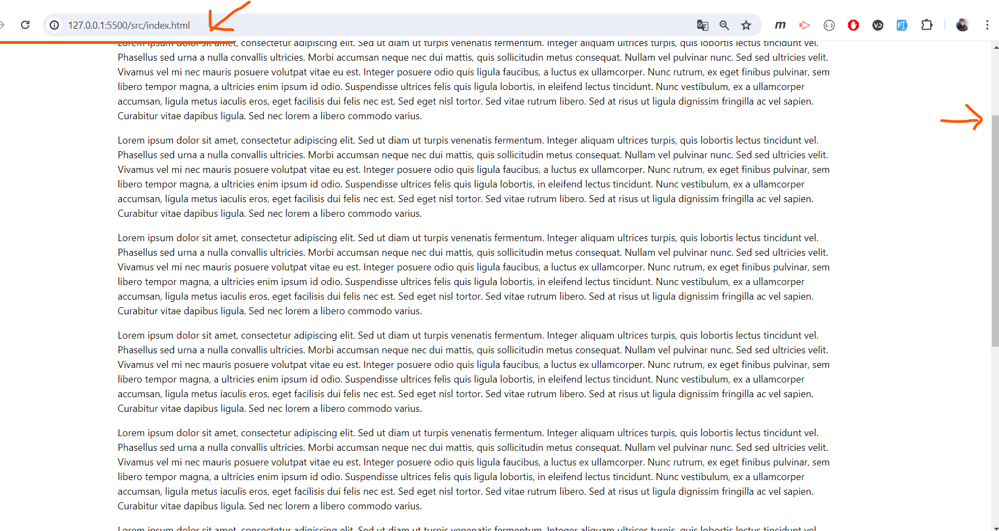

# TailwindCSS - Scrolling with Progress Bar at the Top

This project implements a scrolling feature with a progress bar displayed at the top of the page. It utilizes TailwindCSS for styling and JQuery for handling scroll events.

## Tailwind CSS Installation

- Go to [Tailwind CSS](https://tailwindcss.com/docs/installation) documentation.

## JQuery

- Just include a JQuery CDN.

## Run Application

- Run the [index.html](src/index.html) in your browser.

## Screenshot

## Developer

- [Jerome Soriano](https://github.com/dvxgit-jsoriano)

*"Feel free to read, use, and apply to your projects."*
